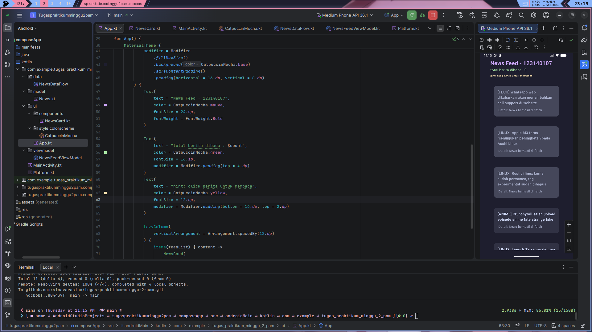
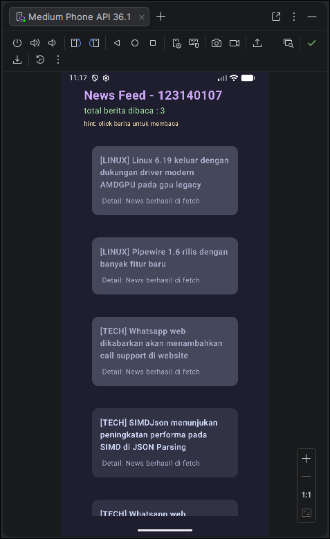

# Tugas 2 PAM - News Feed App 
> this app i made to fullfill my homework/task  
> see [this module](https://kuliah2.itera.ac.id/pluginfile.php/63172/mod_resource/content/1/Materi_02_Advanced_Kotlin_Coroutines_Flow.pdf) for futher details.

---

## Student Identity
Name = Varasina Farmadani  
NIM = 123140107  
Class = PAM RA  

## Screenshoot



## Code Documentation
> its more likely Code Flow  

1. News Model
first of all, i create news model to define how the news will struct,  
the struct (aka dataclass) would be look like this  
```
data class News(
    val id: Int,
    val title: String,
    val category: String
)
```
the news consist of id, title and category.  
and then the object of NewsFactory is used to create/generate new news (with predefined news as dummy data of course),  
you can see this part in [model/News.kt](composeApp/src/androidMain/kotlin/com/example/tugas_praktikum_minggu_2_pam/model/News.kt)
```
object NewsFactory {
    private val dataPairs = listOf(
        Pair("Crunchyroll salah upload episode anime fate strange fake", "Anime"),
        Pair("Whatsapp web dikabarkan akan menambahkan call support di website", "Tech"),
        Pair("Rust di linux kernel sudah permanen, tag experimental sudah dihapus", "Linux"),
        Pair("Linux 6.19 keluar dengan dukungan driver modern AMDGPU pada gpu legacy", "Linux"),
        Pair("Pipewire 1.6 rilis dengan banyak fitur baru", "Linux"),
        Pair("SIMDJson menunjukan peningkatan performa pada SIMD di JSON Parsing", "Tech"),
        Pair("Apple M3 terus menunjukan peningkatan pada Asahi Linux", "Linux"),
        Pair("Linux 7.0 membawa beberapa peningkatan untuk laptop modern", "Linux")
    )

    fun generateNews(id: Int): News {
        val randomNews = dataPairs.random()
        val (title, category) = randomNews
        return News(
            id = id,
            title = title,
            category = category
        )
    }
}

```

2. Data Flow  
to implement flow i create a classes in [data/NewsDataFlow.kt](composeApp/src/androidMain/kotlin/com/example/tugas_praktikum_minggu_2_pam/data/NewsDataFlow.kt),  
it work to emit the new news, you can see it making delay about ~2 sec (2000 millis), create a new news by the with NewsFactory.generateNews (in model/News.kt), passing its id, emit it and iterate the id with post-increment operator (i dont know if the id is thread safe like atomic, since it will only add every 2 sec).  
you can see the code here  
```
package com.example.tugas_praktikum_minggu_2_pam.data

import com.example.tugas_praktikum_minggu_2_pam.model.News
import com.example.tugas_praktikum_minggu_2_pam.model.NewsFactory
import kotlinx.coroutines.delay
import kotlinx.coroutines.flow.Flow
import kotlinx.coroutines.flow.flow

class NewsDataFlow {
    fun getNewsStream(): Flow<News> = flow {
        var currentId = 1
        while (true) {
            delay(2000)
            val newNews = NewsFactory.generateNews(currentId)
            emit(newNews)
            currentId++
        }
    }
}
```

---

This is a Kotlin Multiplatform project targeting Android.

* [/composeApp](./composeApp/src) is for code that will be shared across your Compose Multiplatform applications.
  It contains several subfolders:
  - [commonMain](./composeApp/src/commonMain/kotlin) is for code that’s common for all targets.
  - Other folders are for Kotlin code that will be compiled for only the platform indicated in the folder name.
    For example, if you want to use Apple’s CoreCrypto for the iOS part of your Kotlin app,
    the [iosMain](./composeApp/src/iosMain/kotlin) folder would be the right place for such calls.
    Similarly, if you want to edit the Desktop (JVM) specific part, the [jvmMain](./composeApp/src/jvmMain/kotlin)
    folder is the appropriate location.

### Build and Run Android Application

To build and run the development version of the Android app, use the run configuration from the run widget
in your IDE’s toolbar or build it directly from the terminal:
- on macOS/Linux
  ```shell
  ./gradlew :composeApp:assembleDebug
  ```
- on Windows
  ```shell
  .\gradlew.bat :composeApp:assembleDebug
  ```

---

Learn more about [Kotlin Multiplatform](https://www.jetbrains.com/help/kotlin-multiplatform-dev/get-started.html)…
